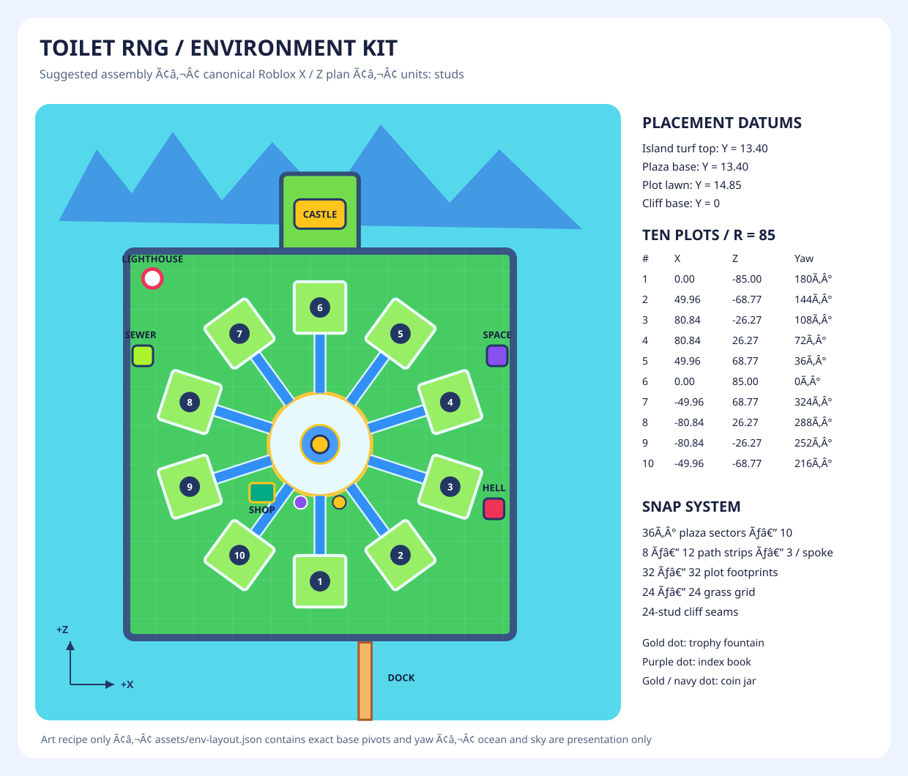

# Toilet RNG environment kit

44 original environment meshes for the saturated toy resort style in the supplied quality reference, spawn panel and plot panel. Navy foundations, porcelain/cyan paving, warm gold trim and green turf reuse **the existing `ToyPalette.png`**, without changing it or the original 31-asset manifest. All assets have a single joined mesh, one material, closed component surfaces, atlas UVs and a base-center origin.

This is an **art handoff** on `feature/envkit`. It does not assemble the live game, modify `src/`, create Roblox asset IDs, publish assets or replace `ModelTemplates.rbxm`.

## Deliverables and regeneration

- `assets/models/env/*.fbx`: 44 FBX files with the palette embedded.
- `assets/blender/generated/env/*.blend`: 44 editable, asset-only scenes.
- `assets/blender/env_builders.py`: original procedural designs and modular dimensions.
- `assets/blender/build_env.py`: environment builder; reuses the original `lib.py` helpers.
- `assets/manifest-env.json`: compatible schema-v1 asset records with family, dimensions, budgets, sockets, source paths and FBX hashes. The original manifest remains authoritative for the existing runtime catalog.
- `assets/validation-env.json`: every FBX checked by the **existing `verify.py`**, extended with optional manifest/output arguments. Defaults still validate the original pack.
- `assets/validation-env-delivery.json`: final file-count, preview-size, hash, modular-contract and placement-total audit, produced by `assets/blender/check_env.py`.
- `assets/previews/<Name>.png`, `<Name>_front.png`: 768-square individual views. Flat pieces use elevated views to expose their working surfaces.
- `assets/previews/_sheet_env_{hub,plot,island,background,hero}.png` and corresponding `_front` sheets: labeled family overviews with triangles and stud dimensions.
- `assets/previews/_env_assembled.png`, `_env_spawn.png`, `_env_plot.png`: assembly studies rendered from the exported FBXs, including selected existing props. Preview ocean, lights and cameras are not exports.
- `assets/env-layout.json`: exact placement recipe for the assembly study. It is a documentation artifact, not a runtime configuration file.
- [Layout diagram](envkit-layout.svg) and [visual review notes](../assets/previews/ENV_REVIEW.md).

From the repository root, using Blender 4.5.10 and the bundled PowerShell/System.Drawing:

```powershell
# Build meshes, sources, two views per asset, sheets, and verify every FBX.
powershell -NoProfile -ExecutionPolicy Bypass -File scripts/build-env-assets.ps1

# Add the assembled / spawn / plot studies and exact placement JSON.
powershell -NoProfile -ExecutionPolicy Bypass -File scripts/build-env-assets.ps1 -Showcase

# Geometry-only iteration still reimports every manifest FBX.
powershell -NoProfile -ExecutionPolicy Bypass -File scripts/build-env-assets.ps1 -NoRender

# Focused rebuild in a PowerShell session with scripts enabled:
./scripts/build-env-assets.ps1 -Only PlotGateArch,ToiletCastle

# Override the Blender location using -Blender 'D:\Tools\Blender\blender.exe'.
```

`-Only` preserves other environment manifest entries. Run a full build after changing shared geometry helpers or the palette. A `-NoRender` build leaves prior PNGs in place; rerender changed assets before review. The build does not download dependencies or upload anything.

For quick design critique without rebuilding exports, run Blender on `assets/blender/env_draft.py -- ToiletCastle ShopKiosk`. This opens the generated sources and writes separate 512px drafts in `assets/previews/env-drafts/`. Final previews always come from the main 768px build.

## Pieces and intended use

| Family | Assets | Intended use |
| --- | --- | --- |
| Hub — 7 | HubMedallion, HubRingSegment, HubCurbSegment, HubPathStrip, HubEdgeStraight, FountainPedestal, PlazaSteps | Ten-way compass plaza; central trophy fountain; bordered spokes and short steps |
| Plot — 7 | PlotPlatform, PlotGateArch, PlotPathStraight, PlotPathCorner, PlotCornerGarden, PlotSignPost, PlotFenceSection | Framed lawn with real recessed fence channels, open arch, blank live-name faces and small gardens |
| Island — 14 | CliffStraightA/B/C, CliffCorner, BeachStrip, BeachCorner, GrassSlab, SmallCove, ShoreRocks, TreeStump, RopeBridge, IslandStairs, DockPier, Lighthouse | Layered cliff facades, exact turf grid, shoreline coves, footpaths and nautical landmark |
| Background — 9 | MountainRidgeA/B/C, CloudBankTall/Wide, FloatingIsletA/B/C, GiantPalmCluster | White-atlas tintable ridges; broad opaque clouds; palm/crystal/stump islets; foreground palms |
| Hero — 7 | ToiletCastle, PortalSewer, PortalSpace, PortalHell, ShopKiosk, IndexBookPedestal, CollectCoinJar | Crowned toilet castle, PortalGate silhouette extensions, striped shop and collection destinations |

All naming and future labels are English. Add live text such as **SHOP**, **INDEX**, **COLLECT**, **Your Plot** or the player's name in Studio/game UI; the blank signs deliberately avoid baking typography or player information into geometry.

## Coordinates, pivots and sockets

One Blender unit is one stud. Authoring is Z-up with the front at -Y. Export follows the existing Z Forward / Y Up pipeline. The diagram and layout JSON use **canonical Roblox X/Y/Z**, with an accepted/corrected front of **-Z** and yaw about +Y. The previous imported template batch required a 180° front correction; check this batch in Studio rather than applying that correction twice.

Every exported mesh has its origin at the horizontal bounds center and lowest vertex. Do not normalize each asset to a common height. Uniform scaling is allowed for decorative landmarks; structural tiles are designed for scale 1.

An arc's center of curvature is deliberately **not** its mesh pivot. Use `sockets_studs.arc_center` from the manifest. To place an arc around a desired world center, rotate that socket by the intended yaw, then subtract the rotated socket from the desired world center to obtain the model's base-pivot position. The showcase uses the same rule.

`sockets_studs` values are base-pivot-relative canonical Roblox coordinates. `author_center_offset` and `assembly` are source-authoring metadata: any three-component points inside `assembly` remain Blender X/Y/Z and must not be treated as Roblox coordinates. Named socket points have already been converted into `sockets_studs`. Flat grid pairs describe width/depth; `surface`, `rise` and `deck_height` are vertical distances above the base.

## Hub snapping recipe

1. Place `HubMedallion` at **(0, 13.4, 0)**. Its radius is 12 studs; highest inlaid emblem is approximately 1.112 above its base.
2. Place ten `HubRingSegment` copies around the same arc center at headings **0°, 36°, …, 324°**. The ring spans radii 12 to 32. Heading zero points toward -Z; use Roblox yaw = negative heading. Correct each base-pivot position using its arc-center socket. Ring pavers top out at +1; the graphic arrows sit slightly above them.
3. Place ten `HubCurbSegment` copies around that center at headings **18° + 36° × n**. Their 20° sectors sit between the spokes and leave path entrances open. Radii are 32 to 33.5.
4. Each spoke takes three `HubPathStrip` copies, centered at radii **38, 50 and 62**, with the same heading as its ring segment. They are **8 × 12** and cover radius 32 through 68. Plot front edges are at radius 69, leaving a one-stud lawn threshold.
5. Put `FountainPedestal` at **(0, 14.512, 0)**; place the existing `GoldenTrophy` at its `trophy_socket` (+3.3 vertically), approximately **(0, 17.812, 0)**. The opaque cyan basin represents water without requiring transparency or particles.
6. `PlazaSteps` is 10 wide, with an 8-stud run and four 0.5-stud risers. Its final tread is 2.12 above the base. Adjust surrounding surfaces to that datum; do not assume a 2.0-high final tread. Reuse `HubEdgeStraight` on straight raised edges.

The round pattern intentionally alternates white and ice pavers with blue spokes and warm gold inlays. Avoid recoloring the entire textured hub mesh in Studio; Color multiplies all atlas colors at once.

## Plot snapping recipe

`PlotPlatform` is exactly **32 × 32** in footprint. Base at island turf Y=13.4; ordinary lawn at **14.85**. Its raised border is higher than the lawn and the front welcome border has an opening. Tile additional lawn with `GrassSlab`, not with repeated framed plot platforms.

Use these local offsets after the plot's inward-facing yaw:

| Piece | Local X / Z | World base Y | Notes |
| --- | --- | --- | --- |
| PlotGateArch | 0 / -14 | 14.85 | 9.7-stud clear pillar width; entrance faces the hub |
| PlotPathStraight | 0 / -7 | 13.85 | Sink foundation into lawn; top approximately 14.89 |
| PlotSignPost | -11 / -11.5 | 14.85 | Study uses scale 0.75; use manifest text socket |
| PlotCornerGarden | ±11 / +10.5 | 14.85 | Two corners, clear of center display slots |
| Back fence runs | -8, 0, +8 / +14.35 | 14.6 | Three sections, 8-stud post pitch |
| Side fence runs | ±14.35 / -8, 0, +8 | 14.6 | Rotate sections 90° relative to plot |
| Existing toilet | 0 / +5 | 14.85 | Study scale 1.45; visual suggestion, not gameplay sizing |
| Existing display stands | -8, -4, +4, +8 / +1 | 14.85 | Study scale 1.35; runtime slot count remains unchanged |

Fence channels run along local X=±14.35 and back Z=+14.35. They are **0.7 wide**, with floors 1.2 above the platform base. Fence posts are 0.6 wide. Adjacent section endpoints share post positions; a 0.04-stud alternating downward offset can hide coincident end-post caps if needed, or remove duplicate end posts in a future assembly-specific export. Do not widen the sections to fill corner gaps; the gardens soften these intentional openings.

`PlotPathCorner` is an L-shaped 12 × 12 piece with 8-wide connections centered at local **(+6, -2)** and **(-2, +6)** in X/Z. Continue straight paths from those centers along +X and +Z. The square outside corner is intentional; there is no raised curb blocking either connection.

## Island and background snapping

- `GrassSlab`: exact **24 × 24**, height **1.4**. Base at Y=12 produces turf at Y=13.4. Its side walls are square to avoid cracks when repeated. The soil is wood brown and the cap green; large raised edges are covered by the cliff facades.
- `CliffStraightA/B/C`: exact 24-stud X seam width, three different front facets, top turf at **13.4**. The facade runs along X with its outside face toward -Z. Repeat at X increments of 24. Rotate 90° at side coastlines. `author_center_offset` reflects the jagged face's bounds, so use that datum when exact source-space alignment matters; the assembly JSON already includes actual base pivots.
- For an unrotated cliff, author turf spans Z=-6…+6. To place that authored strip around a chosen center, add its author-center horizontal offset (converted to X/Z) to the target center. This keeps the cap seams exact despite variant-dependent front protrusions. Match the cap top to grass slabs and allow the cliff cap to overlap the interior turf by about 6 studs. Overlap coplanar caps slightly vertically (0.01) when visible z-fighting occurs in Studio.
- `CliffCorner`: quarter-round facade radius 12 with the same 13.4-high main cap; its lime rim reaches 13.55. Use its arc-center socket. The inner radius of 0.5 is buried under interior lawn. It is an outside-corner dressing piece, not a standalone filled quarter-island.
- `BeachStrip`: 24-stud repeat along X, approximately 8 deep with gently wavy front; sand top at +0.8. `BeachCorner` spans radii 12…20 over 90°. Align arc endpoints to 8-deep strips; its inner radius matches the cliff corner. Beach top should sit above the future ocean; the study uses sand base -0.3 and preview water -0.55.
- `SmallCove`: 260° horseshoe opening toward +Z before yaw, inner radius 9, outer shoulder radius 16. Boulders extend above the grassy shoulder. Its opening is empty geometry; keep render collision off and place water independently.
- `RopeBridge`: deck 8 × 24, deck top **2.625** above base. `DockPier`: deck 8 × 16, same height. Side posts make overall bounds larger than the deck. Repeat by deck length, not the bounding-box size. Caps and ropes are part of the joined mesh. Two modules meet with a 0.14-stud plank seam; shared end posts overlap. No boats, animated ropes or water are included.
- `IslandStairs`: 8 wide, four risers, 8-stud run, final top +2.12. It is a short terrace connector, not a complete descent down a 13.4-high cliff. Stack flights with landings and explicit collision ramps in a later assembly.
- `MountainRidgeA/B/C`: neutral white-atlas color, broad closed faceted peaks, 36 triangles each. Tint through MeshPart Color (suggested sky blues in manifest), use roughly 1–2× scale and place behind the island. They are silhouette scenery, with intentionally simple overlapping closed peaks; do not use them as close-up traversable terrain.
- `CloudBankTall/Wide`: opaque solid cloud lobes, no transparency sorting dependency; disable shadows. `FloatingIsletA/B/C` provide palm, crystal and stump silhouettes. Place bases at 25–55 studs or use isolated small destinations with later collision work.
- `GiantPalmCluster`: three palms joined for local foreground use. Keep the cluster spatially compact; use the existing `PalmTree` for individual placement elsewhere.

## Suggested layout



The study uses a 240 × 240 square island core, a north castle peninsula and ten plots on the existing **85-stud radius**. The square study is a seam/scale proof: rotate or stagger outer facade sections, add coves and beach curves to make a more organic shipped coastline. The exact recipe is in `assets/env-layout.json`; this table highlights the key positions.

| Plot | X | Z | Inward Roblox yaw |
| --- | ---: | ---: | ---: |
| 1 | 0 | -85 | 180° |
| 2 | 49.962 | -68.766 | 144° |
| 3 | 80.840 | -26.266 | 108° |
| 4 | 80.840 | 26.266 | 72° |
| 5 | 49.962 | 68.766 | 36° |
| 6 | 0 | 85 | 0° |
| 7 | -49.962 | 68.766 | 324° |
| 8 | -80.840 | 26.266 | 288° |
| 9 | -80.840 | -26.266 | 252° |
| 10 | -49.962 | -68.766 | 216° |

All plot base pivots are Y=13.4. For heading θ=36°×n: X=85 sin θ, Z=-85 cos θ, plot yaw=180°−θ. Spoke yaw is −θ.

| Destination | Base-pivot X / Y / Z | Study scale |
| --- | --- | ---: |
| ToiletCastle | 0 / 13.4 / 143 | 1.5 |
| ShopKiosk | -36 / 13.4 / -30 | 1.25 |
| IndexBookPedestal | -12 / 13.4 / -36 | 1.1 |
| CollectCoinJar | 12 / 13.4 / -36 | 1 |
| PortalSewer | -110 / 13.4 / 55 | 1.2 |
| PortalSpace | 110 / 13.4 / 55 | 1.2 |
| PortalHell | 108 / 13.4 / -40 | 1.2 |
| Lighthouse | -104 / 13.4 / 103 | 1 |
| DockPier × 3 | 28 / -0.3 / -131, -147, -163 | 1 |

## Roblox import and performance settings

Use the detailed [existing Studio import workflow](asset-pipeline.md). Current API findings and their source links are in [environment research](research/envkit-placement.md).

1. In the intended saved/published experience and correct owner/group, pause Rojo sync for staging. **File → Import** (or Asset Manager's import queue), first select `HubPathStrip.fbx` and `ToiletCastle.fbx`.
2. Set **World Forward Front, World Up Top, Scale Unit Stud, Scale Factor 1**. Use Add to Workspace and Insert Using Scene Position; no rigs, avatar setup or animations. A first local test may leave Upload to Roblox disabled. Never apply a meter conversion or historic 0.01/100 correction.
3. Confirm one mesh and one texture material per file, compare dimensions to the manifest, check upright orientation and the front against both previews. Inspect/correct the containing Model pivot to **base center**. Check socket directions with the asymmetric shop/sign before batching the rest.
4. If colors are missing, reuse/upload `assets/textures/ToyPalette.png` once. Assign it through MeshPart TextureID or the import-created SurfaceAppearance ColorMap/ColorMapContent, avoiding two competing texture setups. Keep Color white except on the explicitly tintable mountain ridges. Shader emission is not expected to transfer.
5. Multi-select the other FBXs in `assets/models/env/`, apply the checked preset, confirm Creator and Upload to Roblox, and review moderation/permission results. Group each as a Model named exactly like its file stem. Keep environment templates separate until a later integration task extends the runtime catalog.
6. During Studio editing set **Anchored true, CanCollide false, CanTouch false, CanQuery false, DoubleSided false, RenderFidelity Automatic** for render meshes. Set **CollisionFidelity Box** in edit mode; this does not make a decorative joined mesh suitable for walking collision. Leave mountains/clouds without shadows and consider disabling shadows on remote islets after an in-engine comparison.
7. Later assembly must add simple anchored invisible collision boxes/ramps for plaza, lawn, paths, stairs, bridge and docks. Keep openings under arches clear. Do not use a Box/Hull collider for the entire horseshoe cove or gate: it closes the empty center. Use queryable/touchable gameplay interaction proxies separately where required.
8. Preserve small spatial modules for culling/streaming. Treat a gate or kiosk as a compact unit; do not join all ten plots or all cliffs into one mesh/Atomic model. Start with existing streaming settings; test the skyline at minimum/target radii before changing them. Persistent is not a general background-scene workaround.
9. Save accepted models as an environment template `.rbxm` only during the later integration task. Record verified model/mesh/texture IDs there; no invented IDs are supplied. Rebuild/reopen the place after that integration, then check low/high graphics, phone-sized UI occlusion, camera sightlines, foot collisions and memory/frame time.

Per-mesh budgets are conservative and checked; the castle is allowed more triangles because it is a single main landmark. Broad silhouettes, opaque materials, a shared 256² atlas and merged local details avoid many tiny render instances. Repeated fences/paths still incur instance and triangle cost: do not treat a low per-asset count as evidence of mobile performance. The assembly JSON reports the actual placed triangle and instance totals, excluding future collision, UI, particles and Terrain.

Measured export totals: **63,200 triangles across 44 unique kit meshes**, maximum **9,800** for ToiletCastle, largest dimension **101 studs**. The fully placed art study has **515 mesh instances / 469,334 triangles**, including reused original props/items/toilets. These are geometry totals, not rendered-frame or mobile benchmarks. Repeated fences are a significant part of this total; remove duplicate endpoint posts in any later assembly-specific merged exports and profile before increasing density.

## Acceptance boundaries and assumptions

Local checks completed: all 44 environment FBX round trips, the delivery audit (44 sources/FBXs, 88 previews, ten sheets and three assembly views), and an original-pack compatibility check of all 31 existing FBXs. `rojo build -o build.rbxl` and `stylua --check --line-endings Windows src scripts` passed. Selene was attempted but cannot run because the configured `roblox` standard library is absent. Git staging was attempted on `feature/envkit`; the sandbox denied creation of the worktree's `index.lock`, so changes are uncommitted and nothing was pushed.

- The rendered kit and FBX round trips are local Blender evidence. Studio upload, moderation, permissions, pivot/front preservation, runtime lighting and device performance remain manager acceptance work.
- No custom LOD meshes are included; silhouettes and low counts are designed to work with Automatic rendering. Test thin gold piping at distance, especially on portals and the lighthouse rail.
- Castle door/windows are solid graphic reliefs; there is no interior. Kiosk goods, book pages, coin pile, leaves, water ripples and portal trim are static. Portal planes, actual glow, waterfall animation and functional interactions are future integration work. Optional waterfall geometry was omitted to avoid presenting a static sheet as a finished effect.
- Joined components intersect but each shell is closed. Meshes are decorative and intentionally not detailed collision hulls. This is also why beach coves and arches require separate collision proxies.
- The layout is a suggested art assembly. It does not replace the existing 640 × 640 Terrain island, alter plot/gameplay dimensions or change display-slot logic. Source and placement JSON are available to adapt the modules in that later task.
