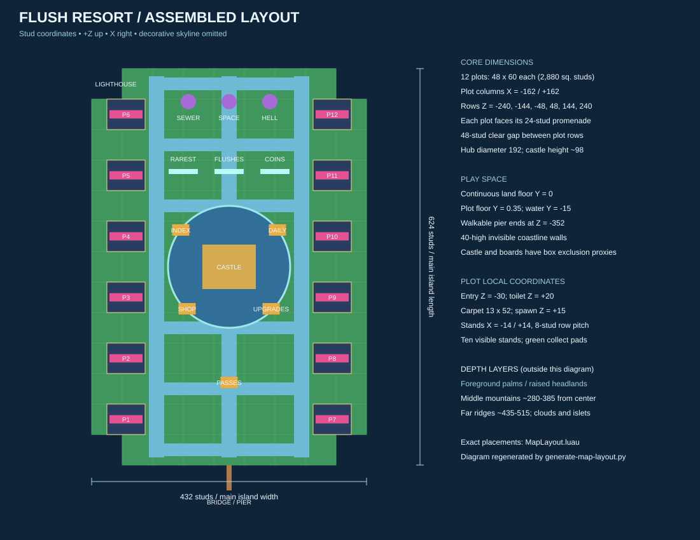
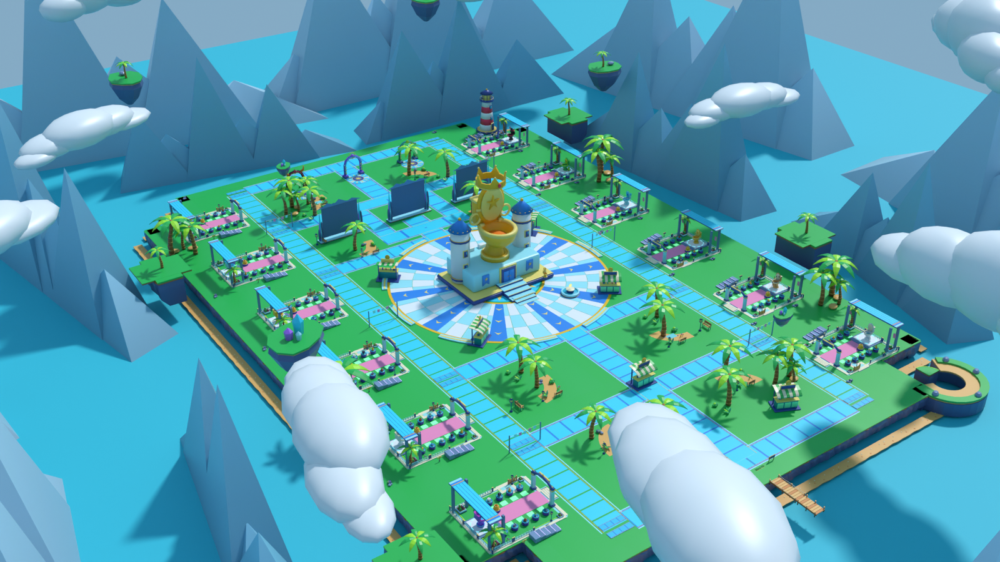

# Flush Resort: huge map assembly

Assembled on `feature/map-assembly`; plot/hub polish on `feature/plot-polish`, October 5, 2026. Changes are intentionally **uncommitted**. No client UI, economy/upgrades services, client reveal code or `Assets.Icons` were edited.

The owner scale overrides the smaller redesign proposal: twelve 48 x 60 plots, a 192-stud plaza, a roughly 98-stud ToiletCastle, and a 432 x 624 main island. Visible architecture, vegetation and ground use the supplied Blender meshes. Terrain supplies water only. The assembly includes striped station booths, three server leaderboards, three coming-soon portals, a lighthouse, a bridge/pier, layered cliffs/beaches, raised headlands, mountain ridges, floating islets and cloud banks.

## Review images and layout

[Hub view](map-previews/hub.png) · [Plot view](map-previews/plot.png) · [Leaderboard view](map-previews/boards.png)

These are **Blender composition previews, not Roblox screenshots**. The exporter runs the production builders against serialized template metadata, then uses the original Blender geometry. Labels now approximate camera-facing billboards, authored text colors and camera distance limits. Water remains approximate; Roblox beams, particle effects, outlines, UI strokes, streaming and post-processing are not reproduced. Boards contain explicitly named preview players. The polish review caught and corrected an owner label hidden behind the entrance arch trim.

| Element | Coordinates / dimensions in studs |
| --- | --- |
| Main island | X -216 to 216, Z -312 to 312; four 48 x 48 corner cells removed |
| Walk surface | Y 0; plots Y 0.35; water top Y -15 |
| Plot columns | X -162 / +162; Z -240, -144, -48, 48, 144, 240 |
| Each plot | Local width 48, depth 60; area 2,880, exactly 2.5 times the proposal's 32 x 36 |
| Plot spacing | 96-stud row pitch, 48 clear studs between plot envelopes |
| Main promenades | X -114 / +114; 24 wide; cross lanes at Z ±96, ±192, ±288 |
| Hub / castle | Center (0, 0); plaza radius 96; castle scale 3 |
| Shop / Upgrades | (-66, -66) / (66, -66) |
| Index / Daily | (-76, 58) / (76, 58); Index also has the open-book pedestal |
| Passes | (0, -182) |
| Trading / Quests scenery | (-65, -262) / (65, -262); awnings and Coming soon signs, no prompts |
| Boards | X -72 / 0 / 72, Z 150; detour lanes at X ±36 |
| Sewer / Space / Hell | X -64 / 0 / 64, Z 260; all marked Coming soon |
| Pier | Along X 0, walkable through Z -352; rail and end proxies |
| Plot interior | Carpet 13 x 52; toilet at local (0, 1.35, 20), uniformly 2.75x; spawn Z 11, facing toilet |
| Display rows | X ±14, Z -19, -11, -3, 5, 13; ten green collect pads |
| Toilet dais | 18 x 18 lower step, 15 x 14 upper step; rises 0.6 + 0.65; ten curved segments form an open glow ring |
| Owner sign | Arch front at local (0, 14.65, -29.05), 13.8 x 2.7; no low pedestal-overlapping owner sign |
| Rear pavilion | 46-wide roof at Y 22.5, four thick pillars, two pink banners; clears imported and primitive fallback tier ornaments |
| Rebirth placeholder | Local X 28, five terraces at Z -16 to 0, ascending 0.65; locked signs, visual only |
| Collect jar | Local (-6, 0.15, 5), off the central approach; aggregate collection remains unchanged |

The nearest plot center is approximately 169 studs from the landmark center; the furthest is 290. At an assumed 16 studs/second these straight-line distances are about 11–18 seconds; walking around the castle increases some routes. From the plaza's nearest edge to a plot center is at least 73 studs, about 4.6 seconds. Booth separation is over 115 studs. These are geometric estimates, not timed Studio walks.

## Runtime and contracts

- `default.project.json` maps both template libraries, including **44 EnvTemplates models**. `TemplateLoader` normalizes and caches each template against its independent manifest bounds; imported source models remain unchanged. All 75 supplied models are covered by the checks. Existing mesh and texture references are reused; no asset IDs were invented.
- `MapLayout.luau` contains explicit transforms, dimensions, station metadata, slots, boards and budgets. `Kit` creates small independently streamable models, mesh surface variants, invisible GUI anchors and collision boxes. Solid pink carpet, green collect pads, navy board panels and pavilion posts reuse kit meshes with a solid finish.
- Ground consists of 113 GrassSlab meshes over the same 113 invisible collision tiles, with cliff and beach modules along exposed edges. The former four render tiles per collision cell were consolidated to fund decoration while retaining 48-stud streaming units. Decoration is anchored, noncolliding, nonqueryable and nontouchable. Collision/query are enabled only on invisible walk/safety/exclusion boxes, including two shallow toilet steps per plot. Forty-stud coastline walls prevent ordinary falls; the pier has its own deck and rails. Castle and board footprints are excluded from routes. Scenic cliffs, roofs, Rebirth terraces and floating islands are not playable interiors or platforms.
- Streaming uses minimum radius 128, target 512 and `PauseOutsideLoadedArea`. Home, Hub and Shop travel request nearby content before moving. Only 25 landmark/skyline meshes (21,186 source triangles) are Persistent; the island and plots stream normally. Their size is capped in checks. ReplicatedStorage templates still consume client memory.
- Friend assignment picks the physically nearest free plot to an online friend, preserving deterministic ties and full-server handling. `PlotCenter` and the new fixed `FlushAnchor` share the toilet foot datum. The existing client FLUSH check reads that BasePart; the server still reads `plot.CFrame`. `PlotCFrame`/`PlotPosition` use the safe Home destination 9 studs in front, within the existing 10-stud prompt range. `PlotSignPosition` now targets the gate header, so owner-only guidance follows it without a client change. Tier swaps uniformly scale around the same base and replace exactly one owner prompt; upgrade rings flash gold and swell for 1.5 seconds. Server RNG and currency contracts remain intact.
- Display slot indexes and the saved capacity limit remain unchanged. Ten physical stands show pages of the existing capacity; pages rotate every ten seconds. Empty labels render only within 18 camera studs; locked slots use a small lock glyph at that distance. Occupied labels retain name, rarity, base `1 in X` odds and actual capped income/minute within 65 camera studs. Epic+ mesh items retain rarity aura and occluded outline, distance-disabled with other idle effects beyond 100 studs. Green collect pads now use a Neon finish.
- The CollectCoinJar and every green pad collect **aggregate pending display income**, using the existing remote, session checks, rate limit and save flow. Pad positions are server-owned; owner/life/range validation applies. No per-pad wallet or automatic touch payout was introduced.
- Rarest find, Total flushes and Coins show current-server players and refresh every ten seconds. Total flushes and rarest item records are server-awarded and saved in the profile; wallet coins use the existing saved field. Sanitization rejects nonfinite/out-of-bound values and derives rarity odds from a known item ID. Player names are plain text; equal scores sort by UserId. Coins means current balance, not lifetime earnings.
- Old profiles preserve existing flush/coin counts. Profiles without a rarest-item record begin that record on the next flush; historical items are not retrospectively treated as rolls. **BEST FLUSH EVER remains the existing server-session record**, not a global cross-server leaderboard.
- Lighting uses warm afternoon sun, blue ambient shadows, bloom, atmosphere and color correction. Castle rays, crystal-board accents and ground chevrons use texture-free Beams. Radioactive accents use a low-rate emitter instead of primitive bubble geometry.
- Eight layered sand/garden pockets add palms, shrubs, flowers, foliage, rocks, benches and lamps. Two pockets contain shallow ornamental ponds. Six promenade festival spans use 30 colored flags, with 24 shallow inset paving variants at junctions. Two extra awning stations are explicitly inactive. Four extra clouds and two nearby floating islets add depth without increasing Persistent content. Fourteen additional glowing station chevrons mark approaches.
- Ambient animation reuses the existing local, distance-culled `VisualIdle` controller: six bobbing islets, one rotating coin with a 1/sec sparkle emitter, three gently pulsing portal lights. No continuous server ambient animation loop was added. Upgrade glows use ten infrequent bounded server tweens per upgrading plot; prior tweens are cancelled on replacement/release.

## Budgets and measured checks

These are authored workload limits, **not mobile performance certification**. The peak envelope assumes twelve fully populated plots and two overlapping transient drops per plot. Triangle counts come from source manifests; they exclude particles, UI, water and engine-generated LOD. Instance counts cover the generated world, not avatars, client UI, replicated template storage or the entire DataModel.

| Metric | Measured / reserved | Enforced limit |
| --- | ---: | ---: |
| Shared hub/island parts | 925 | 1,600 |
| Shared hub/island meshes / source triangles | 657 / 399,032 | Included below |
| Worst plot with two drops, templates ready | 134 parts | 225 |
| Worst plot with two drops, all fallback | 208 parts | 225 |
| Peak ready world | 2,533 parts | 3,600 |
| Peak all-fallback world | 3,421 parts | 3,600 |
| Peak ready MeshParts | 1,689 | 1,700 |
| Peak ready source triangles | 1,382,312 | 1,400,000 |
| Peak ready / fallback world instances | 6,342 / 6,858 | 11,000 |
| Persistent skyline | 25 meshes / 21,186 triangles | 25 / below 30,000 |
| Shared Beams | 70, plus 2 local owner-guide beams | 140 |
| Highlights | Up to 120 displayed + 24 transient | 144 |

The local plot part allowance rose from 180 to 225 to accommodate the dais, ring, lamps and Rebirth scenery; **all global part/mesh/triangle/instance limits remain unchanged**. Mesh headroom is only 11 and triangle headroom 17,688: further additions need offsetting reductions. Instance totals include live FLUSH prompts and two transient drops per plot; Lua tables and unparented Tween objects are not world descendants. Repeated objects reuse mesh/texture content. Kit imports already merge each asset into one MeshPart; spatial modules are not merged into an island-sized model because that would undermine streaming. Nearby GUI/VFX overdraw and template download memory still require device measurement.

## Files and tuning

The main implementation is `src/shared/Config/MapLayout.luau`, `src/server/World/Kit.luau`, `Builders/{Hub,Plot,Island,Lighting}.luau`, `DisplayRows.luau`, `IncomeDisplay.luau` and `WorldService.luau`. Supporting changes cover `MeshCatalog`, `TemplateLoader`, `LeaderboardStats`, profile/flush/income services, `PlotChooser`, non-UI client navigation, idle effects and plot guidance. No screen UI implementation was changed.

1. Edit `scripts/generate-map-layout.py` for permanent authored layout changes. Run it with Python 3, then format the generated `MapLayout.luau` and `MeshCatalog.luau` with StyLua. It also regenerates `docs/map-layout.svg`. Direct config edits work at runtime but are overwritten by the generator.
2. World placement positions use base pivots in studs. `Scale` is uniform. `Size` is reserved for architectural stretching after canonical normalization; do not stretch item/toilet artwork. Hub ring placement uses the mesh's authored arc-center socket.
3. Keep plot changes synchronized with `PlotWidth`, `PlotDepth`, `Slots`, `ToiletOffset`, collect positions and safety proxies. Re-run reachability and spacing checks when changing any route, obstacle or border.
4. Tune light/atmosphere in `Builders/Lighting.luau`, streaming in `default.project.json`, and label/effect distances at their creation sites. Treat target radius as desired coverage, not a guarantee.
5. Run `powershell -NoProfile -ExecutionPolicy Bypass -File scripts/check-visuals.ps1 -World -Snapshot`, then `blender --background --factory-startup --threads 8 --python scripts/preview-map.py` for the four offline views. The Blender script uses the installed Windows Arial Bold font only for approximate review labels.

## Verification and remaining weaknesses

Passed: `stylua --check --line-endings Windows src scripts`, `rojo build -o build.rbxl`, every standalone `scripts/check-*.luau`, `check-audit.ps1` (37 regressions), `check-ui.ps1`, `check-visuals.ps1`, and all six `check-world.ps1` scenarios. Audit/UI harness source files run through their PowerShell entry points. Extended checks build all twelve rotated plots, verify shallow dais collision, Home within FLUSH range, all seven real refresh/tier paths, one fixed prompt, repeated-refresh idempotence, overlapping upgrade tween cancellation, gate-sign clearance, nearby lock labels, five inactive Rebirth signs, seven station footprints, bounded ambient coverage and unchanged global budgets. The existing 4-stud reachability grid with 2-stud clearance has **15,542 reachable samples**, alongside all **49,152** friend cases, imported-template checks and leaderboard regressions.

- **No connected Roblox Studio was available** (`studios: []`), and launching the installed executable did not produce a connected session. No engine playtest, published asset permission check, rendered Roblox screenshot, multi-client streaming test or phone frame-time/memory capture was completed. The headless graph is not avatar physics simulation. Final engine visual acceptance is outstanding.
- **Selene could not run** because its configured `roblox` standard library is missing. StyLua, Luau execution and Rojo passed; this does not substitute for Selene analysis.
- Imported RenderFidelity is verified Automatic. CollisionFidelity is opaque in the binary PhysicalConfigData inspected by Rojo. Mesh collision is disabled, but edit-time Box fidelity still needs Studio verification/resave. No unsupported runtime write was added.
- The core circulation plane is intentionally level and broad. Chunky mesh borders, tiled paths, cliff bands, cove and raised headlands create depth; this does not reproduce dense classic Roblox stud geometry. The supplied GrassSlab has a comparatively smooth surface. The silhouette is still largely rectangular rather than a sculpted freeform island.
- Booths share the supplied green striped awning; pavilion roofs are stretched kit path meshes. The map is denser, but still repeats a small modular kit and retains some broad lawns. Dense **occupied** nametags, billboard scale and outlines require in-engine legibility review, especially on phones. Empty-slot visibility uses camera distance rather than nearest-character selection: zooming out can hide a nearby empty label. The owner guidance billboard still uses the existing fixed screen size, now at the arch.
- The global geometry budget is nearly full. This is a budget-compliant authored scene, **not mobile certification**. Islet motion only runs within the existing 100-stud camera cutoff; distant skyline islets can be static. The coin/portal effects and upgrade pulse are not reproduced in the Blender stills.
- Rebirth is five labelled **visual-only** locked terraces, with no walk collision, purchase, remote or progression. Trading and Quests are also scenery only. Toilet meshes remain noncolliding artwork above the walkable dais; engine avatar interaction still needs review. The published place must verify lock-glyph font support and long owner names.
- Mountains and islets are scenic. Invisible coastline walls may feel abrupt near the water. The castle has no playable interior, and portals intentionally have no destination gameplay.
- Missing/invalid templates retain simple primitive fallbacks. An otherwise valid MeshPart whose uploaded content fails to download cannot be detected by these offline tests; that requires a published-client permission check.

Current API decisions and source links: [polish runtime research](research/plot-polish-runtime.md), [map runtime research](research/map-assembly-runtime.md). Reference interpretation: [reference analysis](design/reference-analysis.md), [map quality research](research/map-quality.md).
